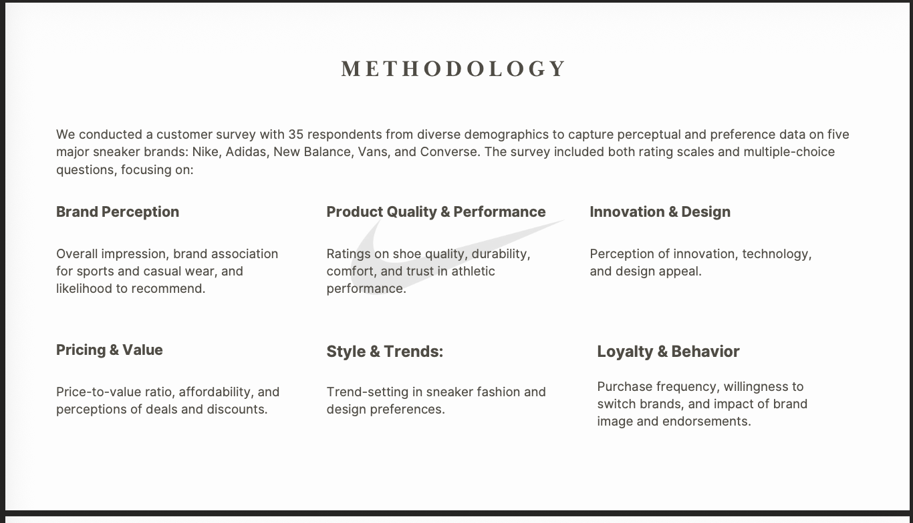
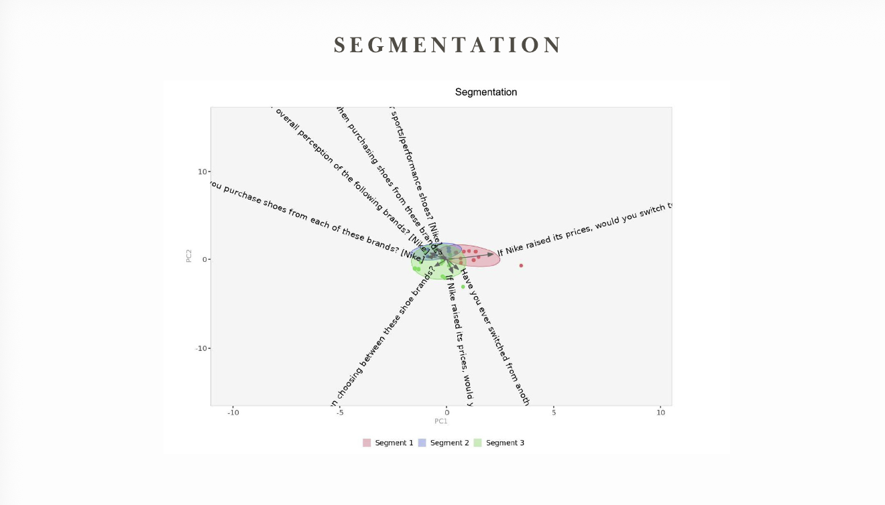
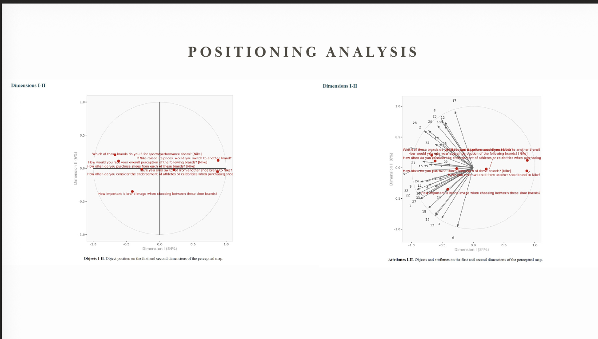
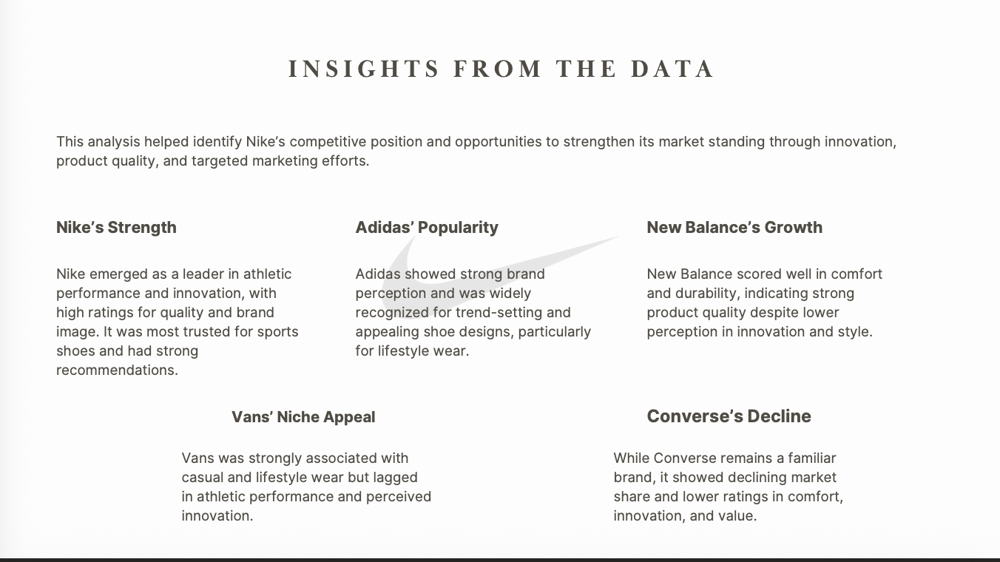
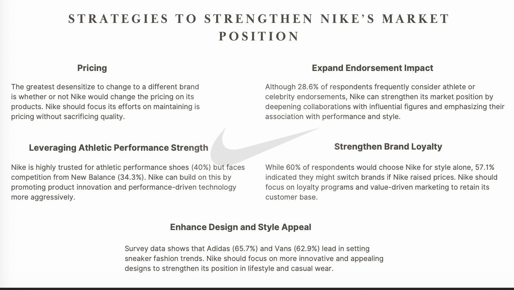

# Nike Market Segmentation & Positioning (Survey + Perceptual Mapping)

Survey-based segmentation and positioning analysis (**n=35**) comparing Nike vs Adidas, New Balance, Vans, and Converse to identify market opportunities and recommend positioning actions.

## Business Objective
Understand brand perception and customer preferences to identify Nike’s strengths, competitor threats, and positioning opportunities (performance vs lifestyle).

## Data
- Primary data: customer survey (**n=35**)
- Brands: Nike, Adidas, New Balance, Vans, Converse
- Measures: perception, quality/performance, innovation/design, pricing/value, style/trends, loyalty

## Analysis
- Cleaned and validated survey responses
- Built segmentation + perceptual maps (**90% variance explained**)
- Summarized key insights and recommended positioning actions

## Key Insights (High level)
- Nike: strong performance + innovation perception
- Adidas/Vans: stronger lifestyle/style association
- Price sensitivity noted (switch risk if Nike prices rise)

## Recommendations
- Strengthen lifestyle design while maintaining performance leadership
- Protect value perception (loyalty/value messaging)
- Use endorsements strategically to reinforce performance + style

## Key Visuals
(Images will be added in `/artifacts`)

## Files
- Report/Slides in `/docs`
- Key visuals in `/artifacts`

## Key Visuals

## Files
- Summary write-up: [Nike Summary](docs/Nike%20Summary%20.docx)

## Skills Used
Survey design, data validation, segmentation, perceptual mapping, KPI summary, competitive analysis, positioning strategy
